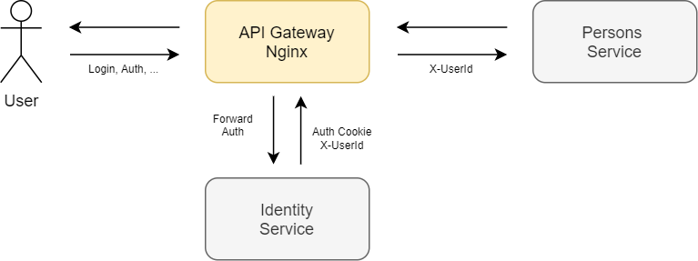

# Nginx Forward Auth

## 1. Описание

В решении для аутентификации используется паттерн **Forward Auth**, где в качестве API GW выступает **Nginx-Ingress**.



* Identity - сервис аутентификации.
* Persons - сервис персональных данных пользователей.

## 2. Установка

Необходимо использовать пространство имен `myapp`:

```
kubectl create namespace myapp
kubectl config set-context --current --namespace=myapp
```

Установка сервисов из helm-чартов:

```
helm install identity ./identity-api
helm install persons ./persons-api

```

В качестве api-gateway и proxy используется ingress-nginx:

```
helm repo add ingress-nginx https://kubernetes.github.io/ingress-nginx
helm install nginx ingress-nginx/ingress-nginx
```

Установка ingress'ов:

```
kubectl apply -f ./auth-ingress.yaml
kubectl apply -f ./app-ingress.yaml
```

## 3. Тестирование


```
newman run nginx_forward_auth.postman_collection.json
```