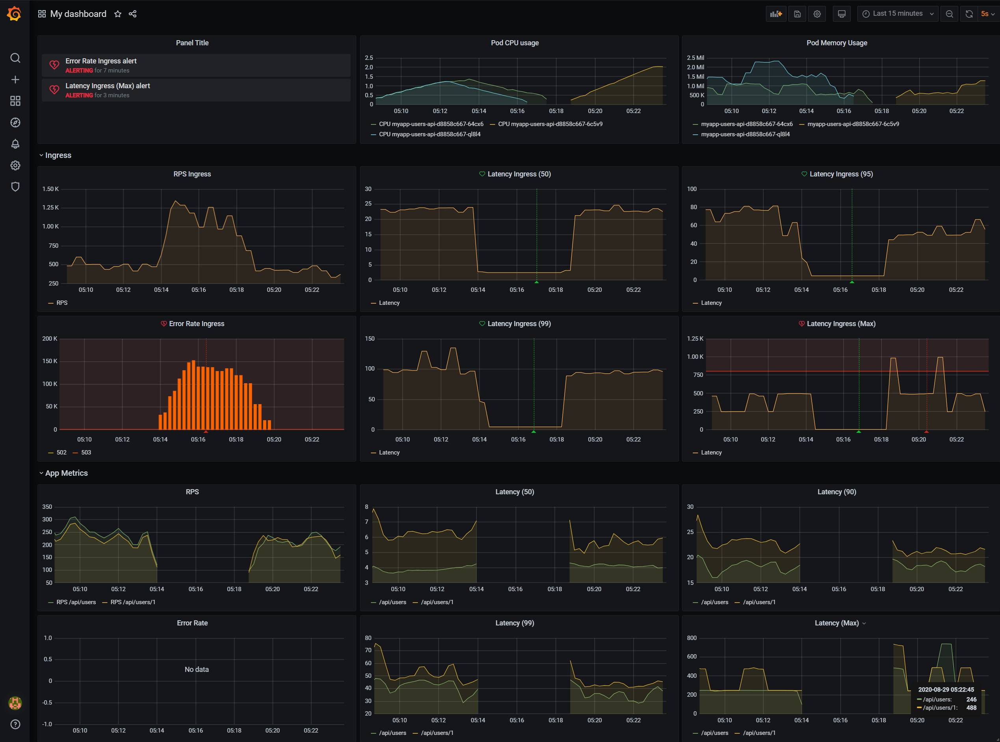

# Prometheus & Grafana



## Prometheus & Grafana

Устанавливаем прометеус с графаной в качестве оператора через хелм.

```
helm repo add stable https://kubernetes-charts.storage.googleapis.com
helm install prom stable/prometheus-operator -f ./src/prometheus.yaml --atomic
```

Портфорвард для прометея и графаны.

```
kubectl port-forward service/prom-grafana 9000:80
kubectl port-forward service/prom-prometheus-operator-prometheus 9090
```

[dashboard.json](./dashboard.json) - файл дашборды для импорта.

## Nginx Ingress

Устанавливаем ингресс-контроллер через хелм.

```
helm install nginx stable/nginx-ingress -f ./src/nginx-ingress.yaml --atomic
```

## Сервис Users.Api

Устанавливаем сервис через хелм.

```
helm repo add bitnami https://charts.bitnami.com/bitnami
helm install myapp .\src\Users.Api\charts\ --atomic
```

Метрики

```
curl -H 'Host: arch.homework' http://arch.homework/otusapp/sergeyyurkin/metrics
```